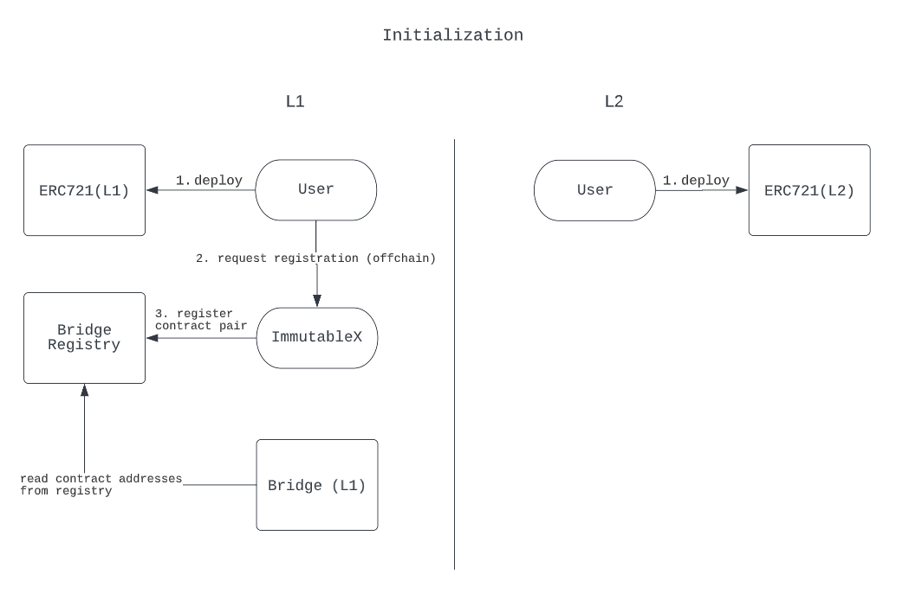
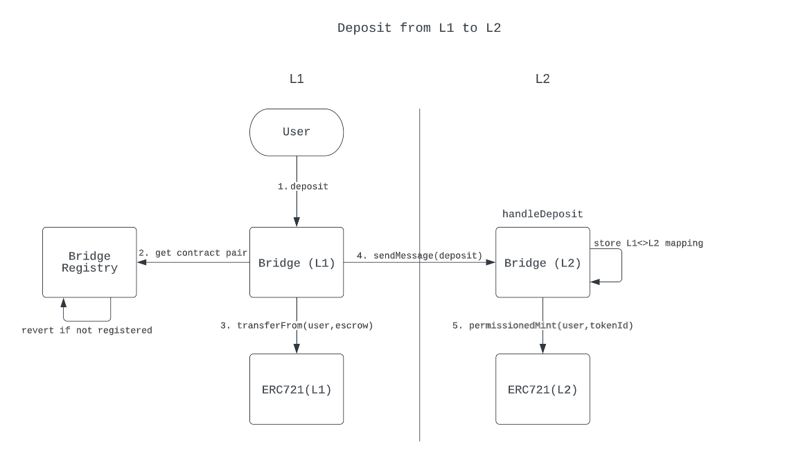
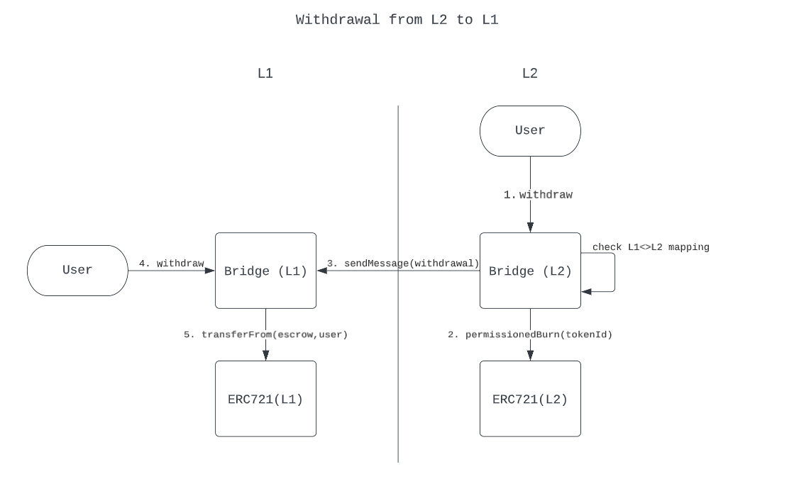

# Arch - ERC721 Bridging Protocol

This readme describes the technical implementation of Arch v1 - an NFT bridge from L1 Ethereum to L2 StarkNet. It was developed for use with ERC721 tokens but can be extensible to other NFT standards like ERC1155 in the future.

The bridge aims to be generalized and contract-agnostic. Project owners must deploy an L1 and L2 token contract, and then register the contract pair to move tokens between layers. The L2 StarkNet token contract must implement `IERC721_Bridgeable`. We have an example ERC721 preset (`ERC721_Full`) in Cairo that works with this bridge implementation. The current design requires Immutable's authorization for registering L1<>L2 contract pairs, similar to many other token bridges being used today, however, we are exploring ways to make the entire process decentralized and permissionless while maintaining security and integrity between layers.

## Deployments

Deployment addresses on Goerli TestNet:
| Layer | Contract | Address |
| --- | --- | --- |
| Ethereum | L1 Bridge Registry | 0x71EcAa73590F828726D2C9ADBc4bECB8E2f47b43 |
| Ethereum | L1 Escrow | 0x7930C5CbC23bB89458C9e8E85B71303c85e1e134 |
| Ethereum | L1 Bridge | 0x6CbC867Ec364B990Cf5FEB8Ef5547FC1A9Fed02F |
| StarkNet | L2 Bridge | 0x066a439ad68e22eddba82468125ea8b33b836501ba877e3baec776acf413d372 |

Deployment addresses on Mainnet:
Coming soon

## Demo/walkthrough

https://youtu.be/MzmeVL0vZ0A

## Contract structure

```
immutablex/
├── ethereum/starknet/
│   └── bridge/
│       ├── interfaces/
│       │   ├── IBridgeRegistry.sol
│       │   ├── IERC721Bridge.sol
│       │   └── IERC721Escrow.sol
│       ├── BridgeRegistry.sol
│       ├── ERC721Escrow.sol
│       └── StandardERC721Bridge.sol
└── starknet/
    ├── bridge/
    │   ├── interfaces/
    │   │   └── IERC721_Bridgeable.cairo
    │   └── StandardERC721Bridge.cairo
    └── token/erc721/
        └── presets/
            └── ERC721_Full.cairo
```

- The bridge contracts are split between `ethereum` (Solidity) and `starknet` (Cairo) folders for the respective L1 and L2 contracts.
- `IERC721_Bridgeable.cairo` is an interface for a contract to be able to be used with the ERC721 bridge implementation, and includes two functions: `permissionedMint` and `permissionedBurn`.
- `ERC721_Full.cairo` is an ERC721 preset that implements `IERC721_Bridgeable.cairo` (alongside other features).

## Contract Interface (StandardERC721Bridge)

```
@contract_interface
namespace IStandardERC721Bridge:
    func get_l1_bridge() -> (l1_bridge : felt):
    end

    func get_l1_address(l2_address : felt) -> (l1_address : felt):
    end

    func set_l1_bridge(l1_bridge_address : felt):
    end

    func initiate_withdraw(
        l2_token_address : felt,
        l2_token_ids_len : felt,
        l2_token_ids : Uint256*,
        l1_claimant : felt,
    ):
    end
end

```

## Design

This ERC721 bridge implementation comprises of four main contracts:

- Bridge Registry (L1)
- ERC721 Escrow (L1)
- ERC721 Bridge (L1)
- ERC721 Bridge (L2)

**Bridge Registry**

The bridge registry contract stores L1<>L2 token contract mappings and acts as the source of truth for the ERC721 Bridge. Contract registration will be permissionless on our Goerli testnet deployment. We plan to use a permissioned approach in the initial mainnet deployment where Immutable will control the registration of token contract pairs, however we will be exploring ways to make this permissionless going forwards.

**ERC721 Escrow**

The ERC721 escrow contract manages the locking and release of ERC721s bridged to L2, essentially a lockbox contract to hold NFTs in escrow. This functionality was decoupled from the main bridge into its own contract to allow for easy upgradability and asset management. Only the bridge contract will be granted permissions to be able to transfer ERC721s to and from the escrow contract.

**ERC721 Bridge (L1)**

This is the main bridging contract on L1 that handles the sending and receipt of messages between L1 Ethereum and L2 StarkNet. End users will primarily interact with the bridge contract on L1. It exposes external functions like `deposit` and `withdraw` to initiate bridging actions.

**ERC721 Bridge (L2)**

The counterpart to the L1 bridge contract, this is a Cairo bridge contract which handles the other side of the L1<>L2 messaging, and is the primary interface for end users to interact with on StarkNet.

## Usage

These diagrams walk through some of the main user flows (registration, deposits, withdrawals).

### Registration

When the token bridge is deployed, project owners will be able to register their L1 and L2 token contract pairs to make their assets bridgeable by interacting with the contract (Goerli) or reaching out to Immutable for a manual registration (Mainnet). We will be looking into making the entire registration process permissionless and frictionless in the future.

Once the L1 and L2 contract pair is registered with the bridge registry contract, users will be able to deposit and withdraw the corresponding ERC721 tokens between Ethereum/StarkNet.



### Deposits

Depositing an ERC721 token from L1 Ethereum to L2 StarkNet. As a prerequisite, the L1<>L2 contract pair must have already been registered in the bridge registry and the user must have approved the bridge contract for spending their token(s) that they wish to bridge (by calling ERC721's `approve` or `setApprovalForAll` methods).

1. Then the user will call `deposit` on the L1 bridge contract.
2. The bridge contract retrieves the corresponding L2 token address from the bridge registry, and reverts if no contract pair can be found.
3. The deposited token(s) will be transferred to the ERC721 escrow contract.
4. A payload will be constructed with the details of the deposit and sent to L2 to be consumed by the L2 bridge contract.
5. Once the message is received on StarkNet (there may be a small delay), the deposit handler on the L2 bridge contract will be automatically invoked, and the token(s) will be minted to the specified recipient on StarkNet through `permissionedMint`.



### Withdrawals

Withdrawal of an ERC721 token from L2 StarkNet to L1 Ethereum. As similar to deposits, the L1<>L2 contract pair must have already been registered in the bridge registry. Note that this current flow only supports withdrawal of L1-deposited tokens, not L2-native tokens (minted on StarkNet only).

1. The user calls `initiate_withdrawal` on the L2 bridge contract to initiate the withdrawal process. This function checks the L1<>L2 mapping in the contract to retrieve the L1 contract address.
2. The token(s) to be withdrawn will be burned through the `permissionedBurn` function on the ERC721 contract.
3. A payload will be constructed with the details of the withdrawal and sent to L1 to be consumed by the L1 bridge contract.
4. To complete the withdrawal, the recipient address on L1 must wait for the message to be consumable on L1 and then call the `claimWithdrawal` method on the L1 bridge contract. The status of the withdrawal can be checked using `isWithdrawable` before calling the actual `claimWithdrawal`.
5. If successful, the escrowed token(s) will be transferred from the escrow contract to the recipient.



## API Specification - L1 (StandardERC721Bridge.sol)

### `deposit`

Initiates the deposit flow. Transfers the specified token(s) to the escrow contract and sends a message to the L2 bridge contract with the details of the deposit. Requires that the bridge contract is approved to transfer the specified tokens beforehand.

Parameters:

```
IERC721 _token
uint256[] memory _tokenIds
uint256 _senderL2Address
```

Returns: None

### `withdraw`

Completes the withdrawal flow that was initiated from L2. Validates the withdrawal parameters against the message received from StarkNet and transfers the withdrawn token(s) from escrow to the recipient.

Parameters:

```
IERC721 _token
uint256[] memory _tokenIds
address _recipient
```

Returns: None

### `isWithdrawable`

Checks a withdrawal payload against consumable messages from StarkNet to see if the withdrawal is valid. Returns `true` if the specified token(s) are ready to be withdrawn and can be used to prevent wasted gas on calling `withdraw`.

Parameters:

```
IERC721 _token
uint256[] memory _tokenIds
address withdrawer
```

Returns: None.

### `initiateCancelDeposit`

In the scenario that the deposit message was not processed or sent to the L2 bridge contract successfully, this can be used to initiate the cancel deposit flow to start the cancellation process.

Parameters:

```
IERC721 _token
uint256[] memory _tokenIds
uint256 _senderL2Address
uint256 _nonce
```

Returns: None.

### `completeCancelDeposit`

Completes the cancel deposit flow and transfers the token(s) from escrow to the caller. Only callable after a waiting period (5 days) following `initiateCancelDeposit`.

Parameters:

```
IERC721 _token
uint256[] memory _tokenIds
uint256 _senderL2Address
uint256 _nonce
address _recipient
```

Returns: None.

## API Specification - L2 (StandardERC721Bridge.cairo)

### `get_l1_bridge`

Returns the corresponding L1 bridge address as a `felt`, with which this L2 bridge is paired with.

Parameters: None

Returns:

```
l1_bridge: felt
```

### `get_l1_address`

Given an L2 token contract address, returns the corresponding registered L1 token address as a `felt`.

Parameters:

```
l2_address: felt
```

Returns:

```
l1_address: felt
```

### `set_l1_bridge`

Sets the address for the L1 bridge that acts as the counterpart for this bridge. Only callable by the contract owner.

Parameters:

```
l1_bridge_address: felt
```

Returns: None.

### `initiate_withdrawal`

Initiates the withdrawal process for the given L2 token contract and list of token IDs, with a specified recipient (claimant) on L1. Called `permissionedBurn` on the token IDs to be withdrawn and sends a message to the L1 bridge with the details of the withdrawal.

Parameters:

```
l2_token_address : felt
l2_token_ids_len : felt
l2_token_ids : Uint256*
l1_claimant : felt
```

Returns: None.
